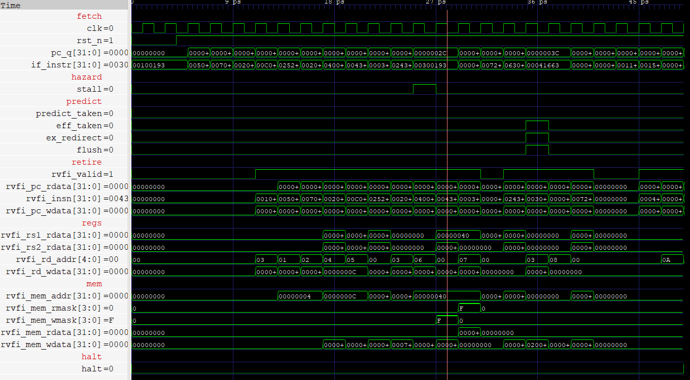

# RV32I CPU

Design and verification of a CPU using RV32I base instruction set. 4 stage pipeline with prediction and hazard detection. 


## Highlights

- **Branch prediction**
I wrote 3 predictors - a two bit predictor, backward taken forward not-taken (BTFN) predictor, and a global shared history predictor (gshare). 
Across 3 sample programs written to show common branch problems, we can predict the branch over 95% of the time. 

Cycles per Instruction (CPI):

| predictor          | bubblesort | search | statemachine | **aggregate** |
|--------------------|-----------:|-------:|-------------:|--------------:|
| none (not-taken)   |      1.660 |  1.454 |        1.413 |     **1.463** |
| btfn (static)      |      1.337 |  1.009 |        1.167 |     **1.165** |
| 2bit bimodal (PHT) |      1.256 |  1.011 |        1.070 |     **1.090** |
| gshare (8-bit GHR) |      1.261 |  1.016 |        1.074 |     **1.094** |

- **Formal verification** using [riscv-formal](https://github.com/YosysHQ/riscv-formal)
  and SymbiYosys, passing 43/43 tests with BMC for depth 30 (far beyond pipeline depth)
  and **39/43 are proved for k-induction.** I wrote invariant assertions to meet k-induction,
  going from 4 tests completing for k-induction, to 39. 

- **Golden-model equivalence**: the pipeline's RVFI retirement stream matches a
  single-cycle reference instruction-for-instruction, across all 4 predictors. This catches
  pipeline-only bugs — a bad forward, a missed flush — that a self-checking test can miss.
  The core also passes the official `riscv-tests` rv32ui suite, and runs common programs like
  bubblesort and binary search. 


A simple program doing some addis and then storing and loading the result, shown in gtkwave


## Quick start guide

```
make lint           # verilator -Wall + verible, the bar RTL has to clear
make verify         # golden-model diff + official ISA test suite, on all predictors
make stats          # CPI and flush-rate tables for all predictors
make formal-setup && make formal-gen && make formal-run && make formal-status
```

`make help` lists every target.

### Dependencies

Only `make lint` and `make verify` are needed to see the core working; the formal
flow is a separate, heavier stack.

| Target | Needs |
|---|---|
| `make lint` | [Verilator](https://github.com/verilator/verilator), `verible-verilog-lint` |
| `make verify`, `make run`, `make stats` | the above, plus a RISC-V GCC toolchain and Python 3 |
| `make formal-*` | the above, plus Yosys — then `make formal-setup` builds the rest into `tools/` |

Notes:

- **Verilator** should be built from source (`stable` branch). Distro packages are
  old enough to trip over the `-Wall` gate and the `--x-initial unique` flags this
  project builds with.
- **RISC-V toolchain**: `riscv32-unknown-elf-gcc`, defaulting to
  `$HOME/tools/riscv/bin/`. Point it wherever yours lives:
  `make verify RISCV_PREFIX=/opt/riscv/bin/riscv32-unknown-elf-`
- **`make verify`** clones the official
  [riscv-tests](https://github.com/riscv-software-src/riscv-tests) on first run.
- **`make formal-setup`** clones riscv-formal and builds yosys-slang, yices2 and a
  patched SymbiYosys into `tools/`, so nothing is installed system-wide. It checks
  for what it can't build for you and tells you what's missing.

## Repo layout

```
design/          RTL: pipeline top, single-cycle golden model, packages, units
verif/sim/       Verilator testbench, directed test programs, riscv-tests glue
verif/formal/    riscv-formal harness, invariants, check config, scripts
tools/           self-contained formal toolchain (fetched + built by setup)
results/         branch predictor performance writeup
```

